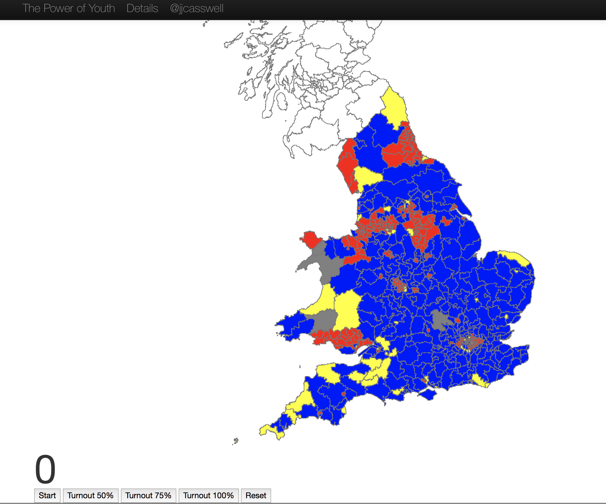

# Rewired State Hackathon: The Power of Youth
## Rationale
For a hackathon I attended in November 2013 hosted by Rewired State

[Video overview of the event](https://www.youtube.com/watch?v=EAIAAlrrNGc)
## Process Steps

I'd attended this Hackathon wanting to do something looking into the low voter turnout amongst young people. 
I had a vague idea about an app that would give an individual an indication of how much their vote was worth (with the intention that it would show how important it was or how it could be improved). 
Messing around with the data sources in the Hackathon and thinking about it in more detail I couldn't think of how to do this. 
However, I had come across some high level polling data (General Election 2010) about voter's ages (which I suspected would be a important factor for my idea) from 
[Ipsos Mori](http://www.ipsos-mori.com/researchpublications/researcharchive/poll.aspx?oItemId=2613)
The Ipsos Mori data gave a figure of 44% for the national turnout of young people (18-24 yrs) but despite searching online I couldn't find a value for each constituency. 
## Data

There was limited time to search for constituency level turnout detail at this age range so I'd use the national figure and apply it all over the country.
I had election results provided by the Hackathon (also available on the ONS) and was able to get population estimates for 2010 from the Office of National Statistics which was, crucially, indexed using the same key - a constituency ID - so I could link the two data sets together.
[ONS Data Repository](http://www.ons.gov.uk/ons/datasets-and-tables/index.html)
Manipulating the vote data was straightforward, I obtained the majority from the election results data and the number of young voters from the population data. Here an assumption had to be made; the turnout statistic was for 18-24yrs,
the population data was segregated into 15-19yrs and 20-24yrs. I assumed the ages were evenly distributed in the age range - and took 2/5ths of the 15-19yr age range as being the 18 and 19yr olds.
The YouthCount script calculated these populations whilst moving the data to a SQLite database.
Some Excel tests showed that for a test constituency, 56% of the total young people, i.e. the ones who, according to this simple model, hadn't voted would be greater than the majority this MP had and could have theoretically overturned the seat.
## Visualising

I could have shown this in a spreadsheet but that would have been dull. It would make a greater statement I thought to show these constituencies changing colour before your eyes. But for that I needed some map data / constituency outlines in data format.

I searched around and found that the [MySociety](http://mapit.mysociety.org/) website had a constituency map service that crucially could be linked by the same constituency ID that the ONS used. But they didn't have a download (that I could find) for a map of the whole UK.
Enter the GetGeoData script created to request each constituency in turn from the service. Being polite I added a second delay inbetween requests to stay within the suggested request load level.

Now I had the constituency level geoJSON data in my database and the CombineGeoData script eventually got me a consolidated geoJSON file that was accepted by other programs as valid geoJSON, but at this stage was 105Mb.
Using the D3 topoJSON tool, which turns geoJSON into a much smaller format. I was able to get my map data down to 780k!
Once I could extract the constituency ID from the topoJSON file and mark each constituency vector with that ID I was pretty much into the home straight. The vote data had a party short name for each election winner (Lab, Con, etc). The D3 script was able to loop through each vector and apply a CSS class corresponding to that party to each vector path - which then coloured each constituency with the colour of the party that won it in the 2010 general election. (All other parties were assigned the value of grey - I wanted to use Green for the overthrown constituencies as it would stand out against the Blue / Red / Yellow of the big three) 

## Putting it all together D3 & HTML

This was quite straight forward - an HTML button would provide a new turnout figure (50%, 75%, 100%), subtracting 44% from this - to take into account the 44% who did vote - and multiplying by the number of young voters in the constituency would give my estimate for the number of new voters to consider. 

Making the assumption that they would all vote tactially against the winner, I just tested if this new figure was greater than the majority. If it was then that constituency had fallen to the Power of Youth and was coloured green.
## Result

I'd made some enormous assumptions and the scientist in me is screaming to make these clear - but the aim was to give young folk a surprise at what their number could theoretically achieve (if perfectly organised etc..etc.  - the scientist again)  - a shock to the system of Parliament and party politics.

## Link

[The simulation can be seen here](http://www.jjcasswell.com/rsparly2013/turnout.html)

## To / Could Do

* Recalculate for the 2015 election
* Get Scottish and Northern Irish data on the map!
* Get turnout data for each constituency.
* Use polling data to predict how the young would actually vote.
               
